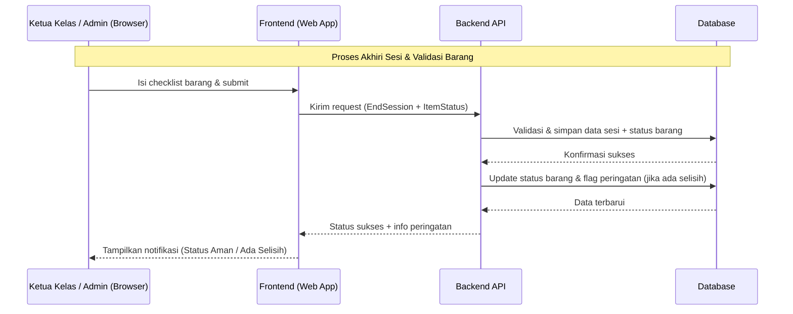
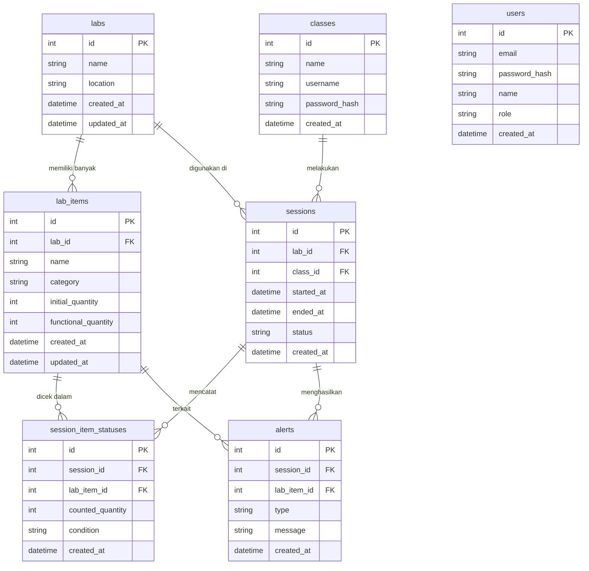

# PRD — Sistem Informasi Inventaris Laboratorium Komputer Berbasis Web

**Nama Produk:** Sistem Informasi Inventaris Laboratorium Komputer Berbasis Web  
**Sasaran Implementasi:** SMK Bintang Nusantara Tangerang Selatan  
**Status:** Draf Pengembangan v1.1  

---

## 1. Overview

Sistem ini bertujuan untuk mendigitalkan pencatatan inventaris dan penggunaan laboratorium komputer yang sebelumnya dilakukan secara manual sehingga rawan data hilang, tidak akurat, dan sulit menelusuri penanggung jawab ketika terjadi kerusakan atau kehilangan perangkat.

Produk akan menyediakan platform berbasis web untuk mengelola aset fisik di laboratorium komputer secara presisi, sekaligus melacak sesi penggunaan ruang oleh tiap kelas secara terstruktur.

Tujuan utama aplikasi:

- Menyediakan sistem terpusat untuk mencatat kondisi, jenis, dan jumlah aset fisik di setiap laboratorium komputer.
- Mengaitkan setiap sesi penggunaan laboratorium dengan akun kelas terautentikasi, sehingga jika ada selisih barang dapat ditelusuri ke kelas yang sedang menggunakan ruangan pada saat itu.
- Memberikan peringatan dini secara otomatis apabila terdapat ketidaksesuaian jumlah atau perubahan status barang (hilang/rusak) langsung di dashboard Admin.

---

## 2. Requirements

### 2.1 High-level Requirements

- **Aksesibilitas:** Aplikasi harus dapat diakses melalui browser web, dengan tampilan yang responsif untuk desktop dan smartphone (agar Ketua Kelas dapat melakukan cek sambil berkeliling lab).
- **Tipe Pengguna:** Sistem minimal memiliki peran Admin/Kepala Laboratorium dan User Ketua Kelas, dengan hak akses yang berbeda (Admin sebagai super user, Ketua Kelas hanya menggunakan fitur sesi dan validasi barang).
- **Data Input:** Input data inventaris dan sesi dilakukan secara manual (ketik/pilih dari dropdown), bukan dengan barcode scanner.
- **Spesifisitas Data Aset:** Setiap barang di lab harus memiliki informasi jenis, lab asal, jumlah awal kondisi baik, dan status terkini.
- **Notifikasi & Peringatan:** Peringatan ditampilkan secara visual melalui pop-up dan penandaan di dashboard ketika terdapat selisih jumlah atau perubahan status menjadi rusak.
- **Keamanan Data:** Password akun kelas maupun Admin disimpan dalam format terenkripsi (hashed) di database untuk mencegah kebocoran kredensial.

### 2.2 Target Users (User Personas)

1. **Admin / Kepala Laboratorium**
   - Mengelola master data laboratorium dan barang.
   - Mengelola akun kelas (membuat, mengubah, menghapus, dan mereset password).
   - Mengakses dashboard untuk memantau status lab, melihat log sesi, dan riwayat peringatan.

2. **User / Ketua Kelas**
   - Login menggunakan akun khusus kelas yang sudah dibuat oleh Admin.
   - Membuka sesi penggunaan lab (check-in) dan menutup sesi (check-out) dengan melakukan validasi jumlah dan kondisi barang.

---

## 3. Core Features (Functional Requirements)

### 3.1 Manajemen Pengguna & Keamanan Akun

- **FR-1 — Manajemen Akun Kelas**  
  Sistem memungkinkan Admin untuk menambahkan, mengedit, dan menghapus daftar *Nama Kelas* yang akan berperan sebagai username di dalam sistem.

- **FR-2 — Manajemen Password Kelas**  
  Admin dapat mengatur, memberikan, dan mereset password unik untuk masing-masing *Nama Kelas*. Password tersimpan dalam format terenkripsi (misalnya menggunakan bcrypt).

- **FR-3 — Dropdown Login**  
  Pada halaman login, kolom username berupa dropdown yang berisi daftar Nama Kelas dan opsi Admin sehingga user tidak perlu mengetik manual.

- **FR-4 — Autentikasi Login**  
  Setelah memilih Nama Kelas dari dropdown, pengguna harus memasukkan password yang sesuai sebelum bisa mengakses sistem.

- **FR-5 — Manajemen Akun Admin (opsional)**  
  Sistem menyediakan minimal satu akun Admin dengan hak akses penuh, dan mendukung penambahan Admin lain apabila dibutuhkan di masa depan.

### 3.2 Manajemen Laboratorium (Multi-Lab)

- **FR-6 — CRUD Data Lab**  
  Admin dapat menambahkan, mengedit, dan menghapus ruangan laboratorium secara dinamis (misal: Lab Komputer 1, Lab RPL, Lab Jaringan).

- **FR-7 — Atribusi Inventaris ke Lab**  
  Setiap barang dihubungkan ke salah satu lab sehingga laporan dan peringatan dapat difilter per lab.

### 3.3 Manajemen Master Data Barang

- **FR-8 — CRUD Master Barang**  
  Admin dapat menambahkan, mengubah, dan menghapus data barang per lab (PC, monitor, mouse, keyboard, kursi, proyektor, dll).

- **FR-9 — Jumlah Awal Kondisi Baik**  
  Sistem menyimpan *Jumlah Awal (Kondisi Baik)* untuk setiap item di tiap lab sebagai baseline sebelum digunakan dalam sesi.

- **FR-10 — Status Barang**  
  Setiap barang memiliki status (Berfungsi, Rusak, Hilang) yang diperbarui seiring sesi dan laporan kerusakan.

### 3.4 Sistem Sesi Penggunaan (Check-in & Check-out)

- **FR-11 — Mulai Sesi (Check-in)**  
  Setelah login, Ketua Kelas memilih lab yang akan digunakan dan menekan tombol "Mulai Sesi"; sistem mencatat timestamp, identitas kelas, dan lab yang digunakan.

- **FR-12 — Validasi & Akhiri Sesi (Check-out)**  
  Di akhir pelajaran, Ketua Kelas membuka form checklist barang, memvalidasi jumlah serta kondisi barang, lalu menekan "Submit" untuk menutup sesi.

- **FR-13 — Otomatisasi Identitas Kelas**  
  Saat sesi dibuat, sistem secara otomatis mengaitkan sesi dengan akun kelas yang sedang login.

### 3.5 Sistem Peringatan & Status Barang

- **FR-14 — Notifikasi Status Aman**  
  Jika jumlah barang dan statusnya saat check-out sama dengan jumlah awal kondisi baik, sistem menampilkan pop-up hijau "Status Lab Aman".

- **FR-15 — Peringatan Kehilangan / Selisih**  
  Jika jumlah barang berkurang dibanding jumlah awal, sistem memunculkan *warning pop-up* merah dan menandai kelas yang sedang login sebagai pihak yang bertanggung jawab di log riwayat.

- **FR-16 — Pencatatan Barang Rusak**  
  Jika ada barang yang statusnya diubah menjadi "Rusak", sistem otomatis mengurangi nilai *Jumlah Barang Berfungsi* pada lab tersebut dan mencatatnya di log.

### 3.6 Laporan & Riwayat

- **FR-17 — Log Sesi Penggunaan Lab**  
  Sistem menyimpan riwayat semua sesi (kelas, lab, waktu mulai, waktu selesai, hasil validasi, selisih barang).

- **FR-18 — Log Perubahan Status Barang**  
  Sistem mencatat setiap perubahan status barang, siapa yang melaporkan, dan waktunya.

- **FR-19 — Dashboard Ringkasan**  
  Dashboard Admin menampilkan ringkasan jumlah lab, total barang, jumlah barang rusak/hilang, dan daftar peringatan terbaru.

---

## 4. User Flow

### 4.1 Alur Ketua Kelas

1. **Login** — Membuka aplikasi, memilih nama kelas dari dropdown, mengisi password, lalu diarahkan ke halaman pemilihan lab.
2. **Awal Sesi** — Memilih lab yang akan digunakan, menekan tombol "Mulai Sesi"; sistem mencatat timestamp dan mengaitkan sesi dengan kelas dan lab.
3. **Selama Kegiatan** — Proses belajar mengajar berlangsung, sistem hanya mencatat bahwa sesi sedang aktif.
4. **Akhir Sesi** — Menekan tombol "Akhiri Sesi", mengisi form checklist barang (nama barang, jumlah awal, jumlah aktual, status), lalu menekan "Submit".
5. **Respon Sistem:**
   - Jika data cocok → tampil layar hijau "Status Lab Aman".
   - Jika ada selisih atau status rusak → tampil peringatan merah, dan data tersimpan di log serta dashboard Admin.

### 4.2 Alur Admin

1. **Login Admin** — Login menggunakan email/username Admin dan password.
2. **Pengelolaan Master Data** — Mengelola data lab, master barang, daftar akun kelas, dan passwordnya.
3. **Monitoring Dashboard** — Melihat ringkasan status lab dan daftar peringatan (selisih barang, barang rusak/hilang).
4. **Penelusuran Log** — Membuka log sesi dan log perubahan status barang untuk investigasi lebih lanjut.

---

## 5. Architecture

Berikut gambaran arsitektur sistem dan alur data secara teknis tingkat tinggi:

Catatan arsitektur teknis:

- Frontend dapat dibangun dengan framework modern (misalnya Next.js atau framework lain yang mendukung SPA/SSR).
- Backend dapat berupa REST API atau server full-stack yang menangani autentikasi, manajemen data, dan logika peringatan.
- Database dapat menggunakan RDBMS (misalnya SQLite/PostgreSQL) dengan skema relasional.

---

## 6. Database Schema

Berikut ERD yang menggambarkan struktur utama database untuk sistem ini:

Penjelasan singkat tabel:

| Tabel | Deskripsi |
|-------|-----------|
| **labs** | Master data laboratorium (nama lab dan lokasi) |
| **classes** | Akun kelas yang digunakan Ketua Kelas untuk login |
| **users** | Akun Admin/Kepala Lab yang mengelola sistem. Field `role` berisi nilai: `admin` atau `lab_manager` |
| **lab_items** | Master barang per lab, termasuk jumlah awal dan jumlah yang masih berfungsi |
| **sessions** | Data sesi penggunaan lab; field `status` berisi nilai: `aman`, `selisih`, atau `pending` |
| **session_item_statuses** | Hasil checklist setiap item pada suatu sesi; field `condition` berisi nilai: `baik`, `rusak`, atau `hilang` |
| **alerts** | Catatan peringatan ketika terjadi selisih/kerusakan; field `type` berisi nilai: `selisih` atau `rusak` |

---

## 7. Non-Functional Requirements

- **Platform & Responsivitas:** Aplikasi harus berbasis web dan responsif, dapat digunakan di PC maupun smartphone.
- **UI/UX:**
  - Halaman login dibuat ringkas: dropdown kelas/Admin, input password, tombol login.
  - Halaman validasi barang dibuat dalam bentuk checklist digital yang mudah dibaca dan diisi.
- **Keamanan:**
  - Password disimpan dalam bentuk hash yang aman di database.
  - Akses ke fitur Admin dan Ketua Kelas dibatasi melalui role-based access control (RBAC).
- **Maintainability & Scalability:**
  - Arsitektur sistem diorganisir dengan pemisahan jelas antara layer presentasi, logika bisnis, dan akses data.
  - Sistem dirancang untuk skala kecil–menengah (beberapa lab, puluhan–ratusan barang) namun tetap memungkinkan ekspansi di masa depan.
- **Auditability:** Setiap perubahan penting (sesi, status barang, peringatan) harus tercatat dengan timestamp dan identitas pelaku (kelas atau Admin).
